# AI Platform Decision Engine

A production-grade enterprise decision tool for evaluating **Google Vertex AI**, **Azure OpenAI**, and **AWS Bedrock**. Built for platform engineering teams, cloud architects, and technical PMs who need data-driven cloud AI platform recommendations.

> Part of the **AI Infra Decision Suite** — a collection of tools demonstrating cloud architecture, enterprise decision frameworks, and platform ecosystem understanding.

---

## Demo Video

https://github.com/Phani3108/AIPlatformComparator/raw/main/docs/demo/demo_walkthrough.mp4

> A full walkthrough showing platform configuration, dynamic scoring, architecture generation, and multi-scenario comparison across all evaluation engines.

[Download demo video](docs/demo/demo_walkthrough.mp4)

---

## Screenshots

### Landing Page

The homepage uses a Google Developer-inspired dark aesthetic with teal/coral accents, showcasing the 5 internal evaluation engines and supported platforms.

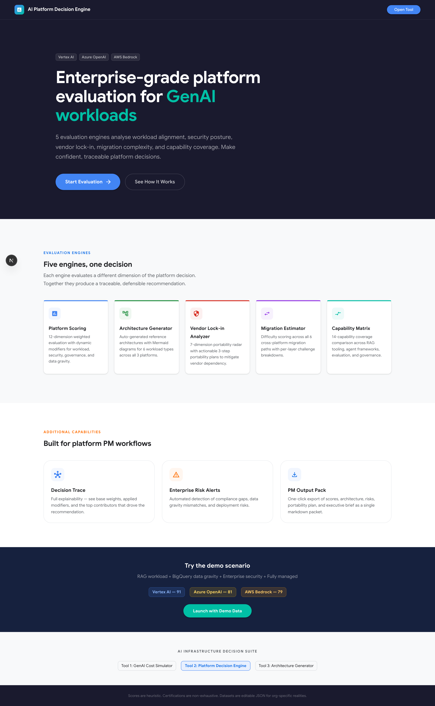

---

### Platform Comparator — Default Configuration

The main decision engine view with the configuration panel on the left and real-time recommendation on the right. Scores update instantly as inputs change.

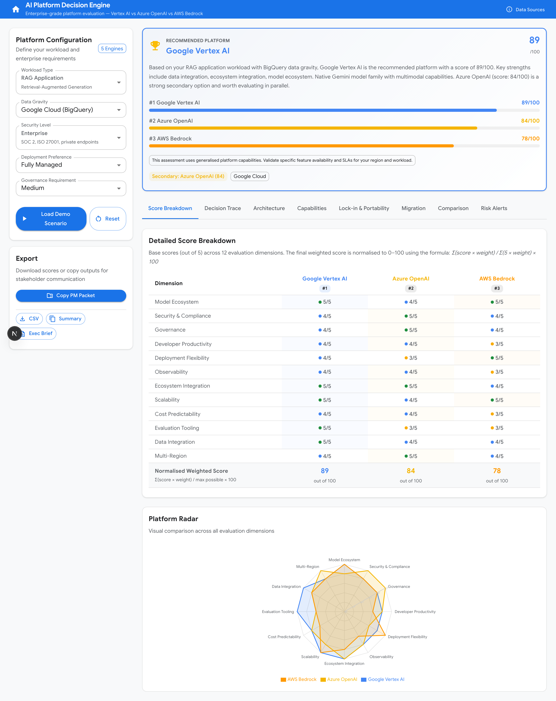

---

### Score Breakdown & Platform Radar

Detailed scores across 12 evaluation dimensions (Model Ecosystem, Enterprise Security, Developer Productivity, etc.). Base scores are rated 0–5; the final weighted score is normalised to 0–100.


---

### Decision Trace

Full explainability: shows base weights, applied modifiers, final weights, and the top 5 contributors to the winning platform. Answers "Why did this platform win?"

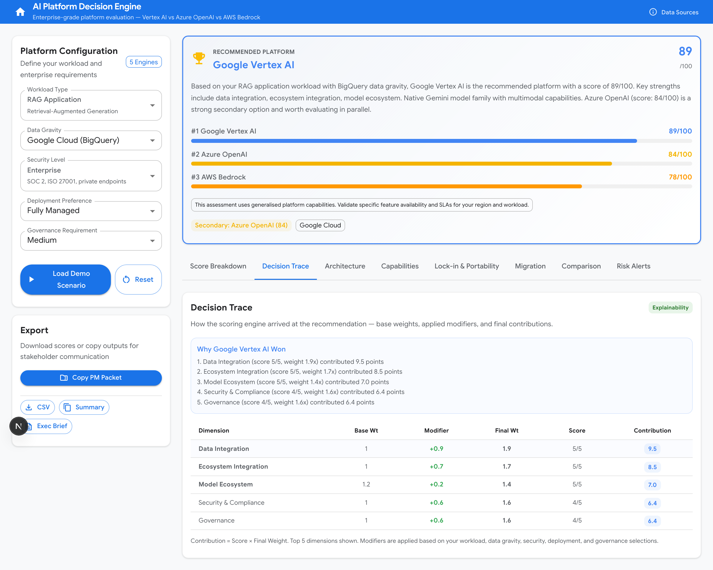

---

### Architecture Generator

Auto-generates reference architecture diagrams (Mermaid) for the recommended platform and selected workload type, with the full service stack listed.

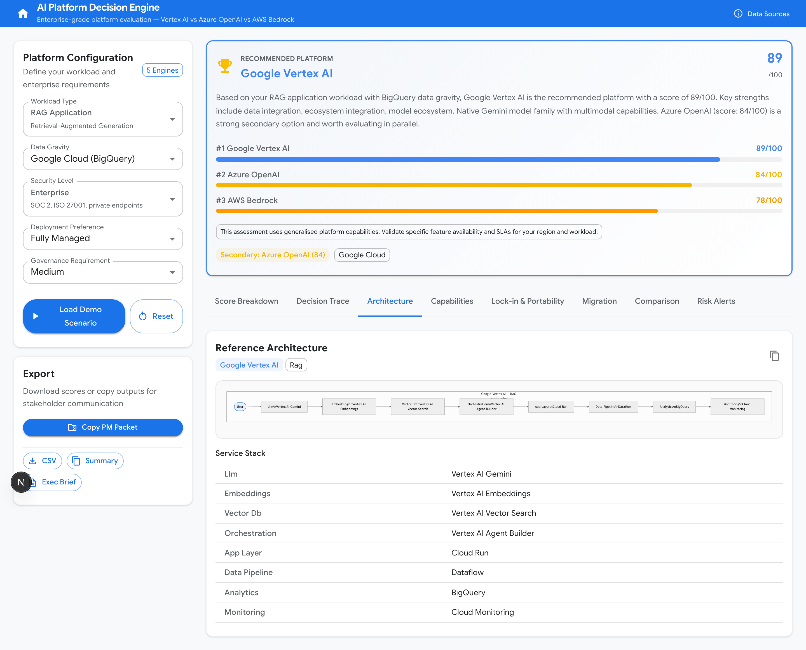

---

### Capability Coverage Matrix

Shows platform support status across 14 capabilities (RAG tooling, fine-tuning, multimodal, guardrails, etc.) with maturity indicators.

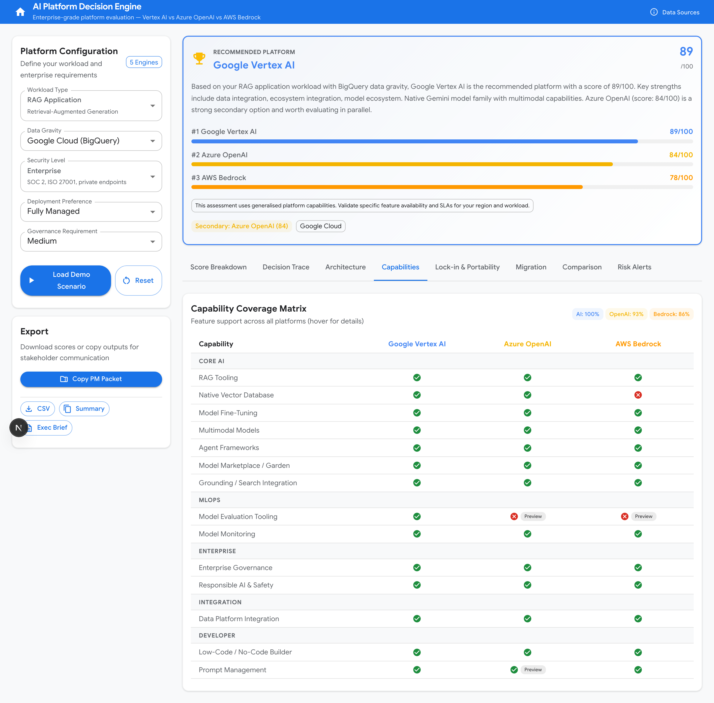

---

### Vendor Lock-in Analysis & Portability Plan

Radar chart showing lock-in risk across 7 dimensions (LLM API, embeddings, vector DB, workflow, data, monitoring, IAM). Includes a 3-step portability plan with actionable migration recommendations.

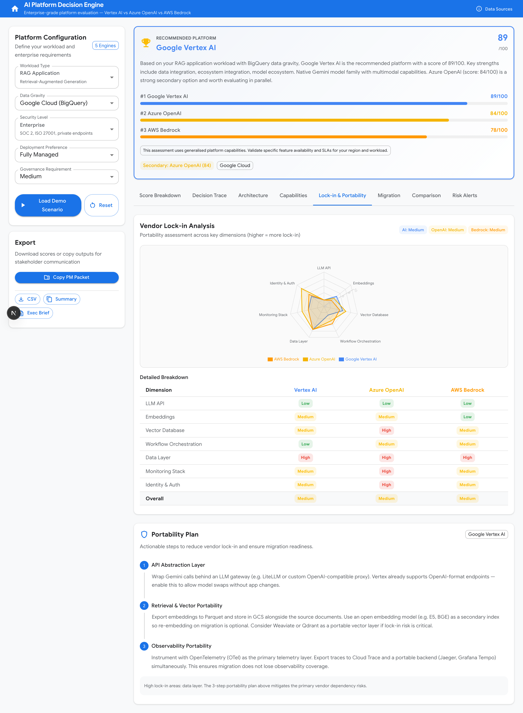

---

### Migration Complexity Estimator

Estimates migration difficulty between any two platforms with effort estimates, key challenges, and difficulty scores.

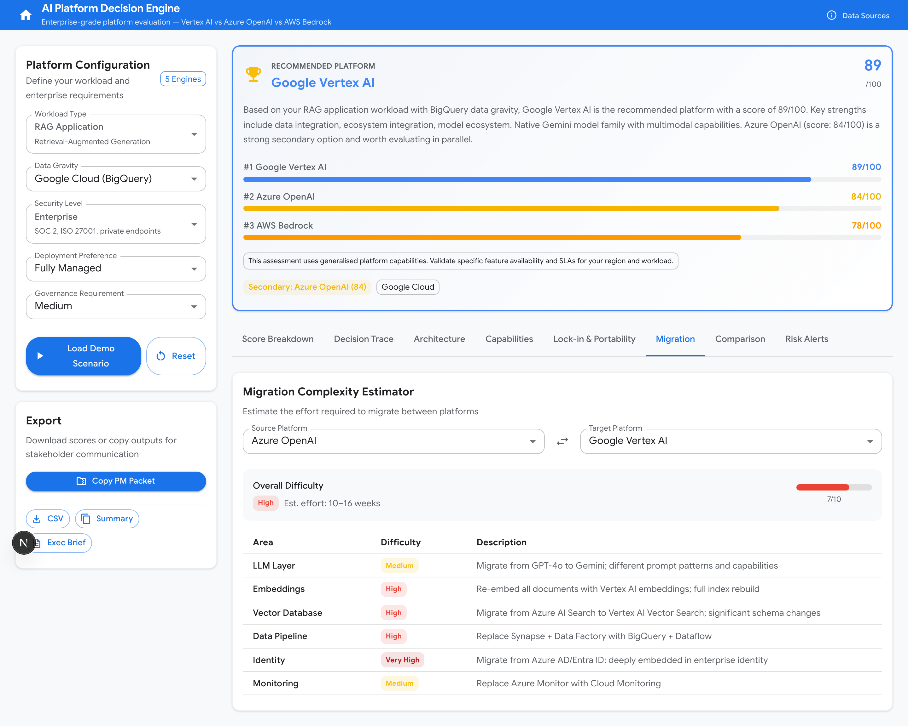

---

### Scenario Comparison

Side-by-side comparison of any two platforms with score differentials, strengths, and lock-in levels.

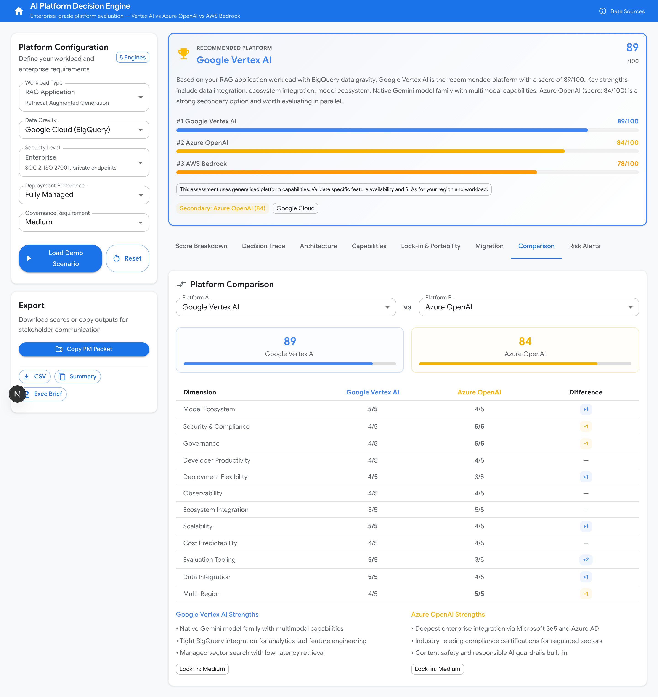

---

### Risk Alerts

Context-aware risk analysis based on your specific configuration — flags vendor lock-in risks, compliance gaps, and architectural concerns.

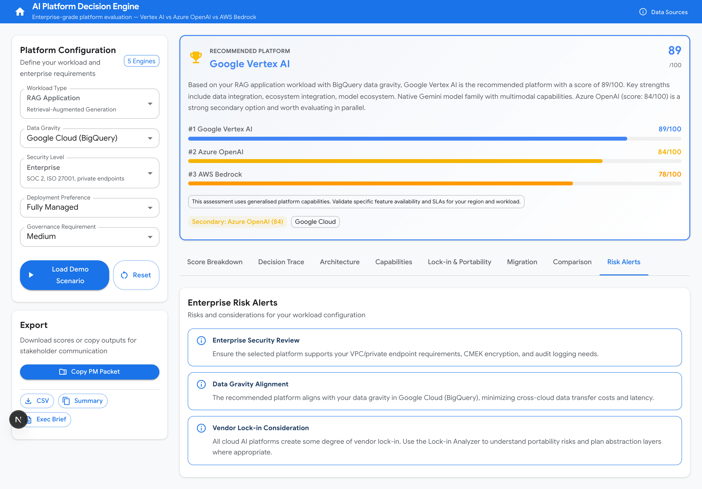

---

### Alternate Scenario — Agent Workflow + AWS + Highly Regulated

Changing the configuration to an Agent workload on AWS with high governance requirements shifts the recommendation and all downstream analyses in real time.

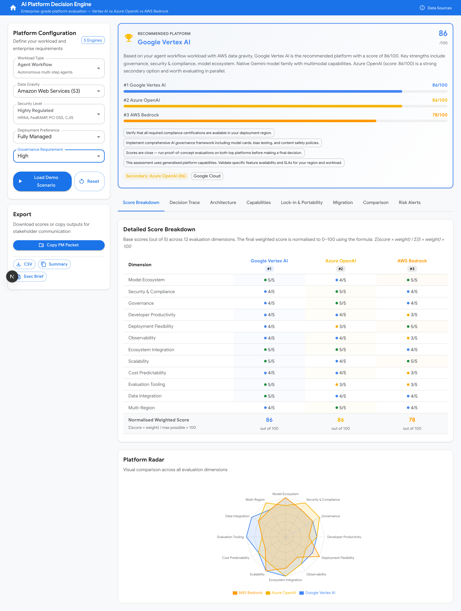

---

### Alternate Scenario — Chatbot + Azure + Standard

A Chatbot workload on Azure with standard security produces a different recommendation, demonstrating the engine's sensitivity to input parameters.

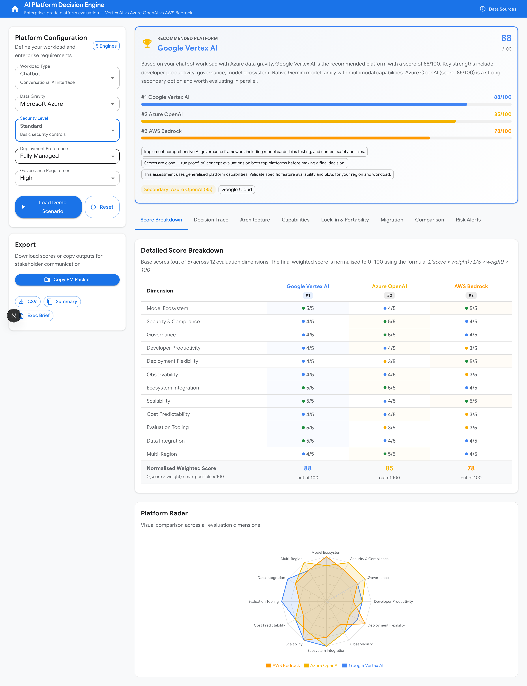

---

### Data Source Disclosure

Transparent methodology drawer explaining that scoring is heuristic and configurable, certifications are indicative, and all datasets are editable JSON files. Shows version stamps.

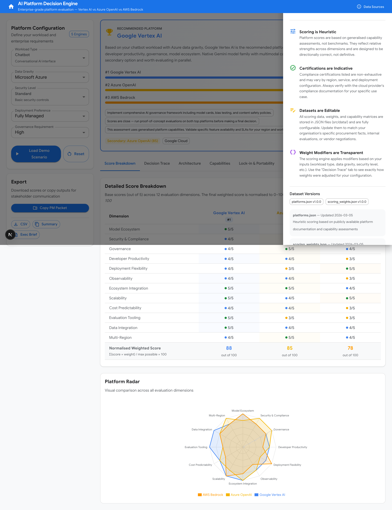

---

## 5 Evaluation Engines

| Engine | Purpose |
|--------|---------|
| **Platform Scoring Engine** | Weighted scoring across 12 dimensions with dynamic modifiers based on workload, data gravity, security, deployment, and governance |
| **Architecture Generator** | Auto-generates Mermaid reference architectures for 6 workload types across 3 platforms |
| **Vendor Lock-in Analyzer** | Evaluates portability risk across 7 dimensions with a 3-step portability plan |
| **Migration Complexity Estimator** | Estimates difficulty of migrating between any two platforms |
| **Capability Coverage Matrix** | Maps 14 AI/ML capabilities to platform support status and maturity |

## Tech Stack

| Layer | Technology |
|-------|-----------|
| Framework | Next.js 16 (App Router) |
| UI | Material UI 7, Emotion |
| Charts | Recharts (Radar), Mermaid (Architecture) |
| Forms | React Hook Form + Zod |
| Language | TypeScript (strict) |
| Data | JSON datasets (editable, versioned) |
| Deployment | Docker (multi-stage), Standalone output |

## Getting Started

```bash
# Install dependencies
npm install

# Run development server
npm run dev

# Build for production
npm run build && npm start
```

Open [http://localhost:3000](http://localhost:3000) to see the landing page, then click **Launch Decision Engine** to enter the comparator.

## Project Structure

```
src/
├── app/
│   ├── page.tsx                    # Landing page
│   ├── layout.tsx                  # Root layout
│   └── platform-comparator/
│       └── page.tsx                # Comparator route
├── components/
│   ├── comparator/
│   │   ├── ComparatorPage.tsx      # Main orchestrator
│   │   ├── ConfigurationPanel.tsx  # User inputs
│   │   ├── RecommendationCard.tsx  # Primary recommendation
│   │   ├── ScoreTable.tsx          # Dimension scores
│   │   ├── DecisionTrace.tsx       # Explainability
│   │   ├── ArchitectureDiagram.tsx # Mermaid diagrams
│   │   ├── CapabilityMatrix.tsx    # Coverage matrix
│   │   ├── LockInRadar.tsx         # Lock-in radar
│   │   ├── PortabilityPlanPanel.tsx# 3-step plan
│   │   ├── MigrationPanel.tsx      # Migration estimator
│   │   ├── ScenarioComparison.tsx  # Side-by-side
│   │   ├── RiskAlerts.tsx          # Risk analysis
│   │   ├── ExportPanel.tsx         # Export actions
│   │   └── DataDisclosure.tsx      # Methodology drawer
│   └── charts/
│       ├── RadarChart.tsx          # Recharts radar
│       └── MermaidDiagram.tsx      # Mermaid renderer
├── lib/platform/
│   ├── scoring.ts                  # Scoring engine
│   ├── architecture.ts             # Architecture generator
│   ├── lockin.ts                   # Lock-in analyzer
│   ├── migration.ts                # Migration estimator
│   ├── coverage.ts                 # Capability coverage
│   ├── risk.ts                     # Risk analysis
│   ├── recommendation.ts           # Recommendation engine
│   ├── trace.ts                    # Decision trace
│   ├── portability.ts              # Portability plans
│   ├── pmpacket.ts                 # PM output pack
│   └── types.ts                    # TypeScript interfaces
├── data/
│   ├── platforms.json              # Platform definitions & scores
│   ├── services.json               # Service mappings
│   ├── scoring_weights.json        # Weight modifiers
│   ├── capability_matrix.json      # Capability support
│   └── enterprise_framework.json   # Evaluation framework
└── theme.ts                        # MUI theme
```

## Export Capabilities

- **CSV Export** — Score table as downloadable CSV
- **Executive Brief** — Markdown summary with recommendation, rationale, and portability plan
- **PM Packet** — Single-click combined output: recommendation, scores, services, risks, lock-in, and portability plan
- **Mermaid Copy** — Architecture diagram code for embedding

## License

MIT

---

## Author

**Created & developed by [Phani Marupaka](https://linkedin.com/in/phani-marupaka)**

© 2026 Phani Marupaka. All rights reserved.

Unauthorized reproduction, distribution, or modification of this software, in whole or in part, is strictly prohibited under applicable trademark and copyright laws including but not limited to the Digital Millennium Copyright Act (DMCA), the Lanham Act (15 U.S.C. § 1051 et seq.), and equivalent international intellectual property statutes. This software contains embedded provenance markers and attribution watermarks that are protected under 17 U.S.C. § 1202 (integrity of copyright management information). Removal or alteration of such markers constitutes a violation of federal law.
