> **Part of [Enterprise GenAI Strategy Console](https://github.com/Phani3108/Enterprise-GenAI-Console)** — the orchestrator that runs this tool alongside 4 other AI agents to produce end-to-end strategy decisions for financial institutions.

# AI Platform Decision Engine

Enterprise decision tool for evaluating **Cloud AI platforms** (Vertex AI · Azure OpenAI · AWS Bedrock) and **Computer-Use Agents** (Claude Computer Use · Browserbase · Manus AI · Replit Agent · Cursor AI).

## ✨ What It Does

- 🎯 **Scores 8 platforms** across 18 weighted dimensions with dynamic modifiers
- 🔀 **Two evaluation modes** — Cloud AI (6 workloads) and Computer-Use Agents (5 use cases)
- 🏗️ **Auto-generates** Mermaid reference architecture diagrams per workload
- 🔒 **Analyzes vendor lock-in** with 7-dimension radar + 3-step portability plans
- 🔄 **Estimates migration** difficulty between any two platforms
- 📊 **Maps 24 capabilities** to platform support & maturity status
- ⚠️ **Flags risks** — compliance gaps, data gravity mismatches, credential exposure
- 🧪 **Generates pilot plans** — 7-week structured rollout for computer-use agents
- 📋 **Exports** PM packet, vendor scorecard, CSV, and executive brief

## 🖥️ Suite Context

| Mode | URL | Behavior |
|------|-----|----------|
| Standalone | `localhost:3000` | Full app with navigation |
| Embedded | `localhost:3002/platform-comparator?embed=1&scenario=...` | Header hidden, scenario prefilled |

| # | Agent | Repository |
|---|-------|-----------|
| 0 | **Console (orchestrator)** | [Enterprise-GenAI-Console](https://github.com/Phani3108/Enterprise-GenAI-Console) |
| 1 | Cost Intelligence | [GenAICostCalulator](https://github.com/Phani3108/GenAICostCalulator) |
| 2 | **Platform Decision (this repo)** | [AIPlatformComparator](https://github.com/Phani3108/AIPlatformComparator) |
| 3 | Architecture Studio | [VertexAIArchitectureGenerator](https://github.com/Phani3108/VertexAIArchitectureGenerator) |
| 4 | Enterprise Readiness | [Enterprise-AI-Analyzer---Banking](https://github.com/Phani3108/Enterprise-AI-Analyzer---Banking) |
| 5 | Product Strategy | [AI-Product-Strategy-Lab---Financial-Institutions](https://github.com/Phani3108/AI-Product-Strategy-Lab---Financial-Institutions) |

---

## 🎬 Demo Video

https://github.com/Phani3108/AIPlatformComparator/raw/main/docs/demo/demo_walkthrough.mp4

> Full walkthrough — platform configuration, dynamic scoring, architecture generation, and multi-scenario comparison.

[Download demo video](docs/demo/demo_walkthrough.mp4)

---

## 📸 Screenshots

### Landing Page

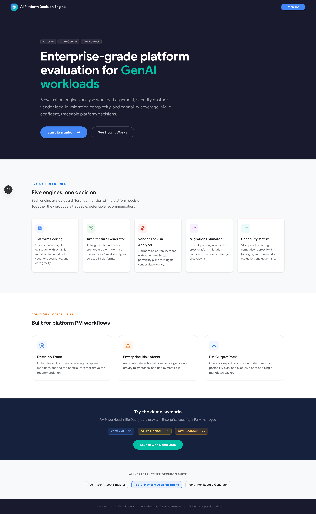

---

### Platform Comparator — Default Configuration


---

### Score Breakdown & Platform Radar

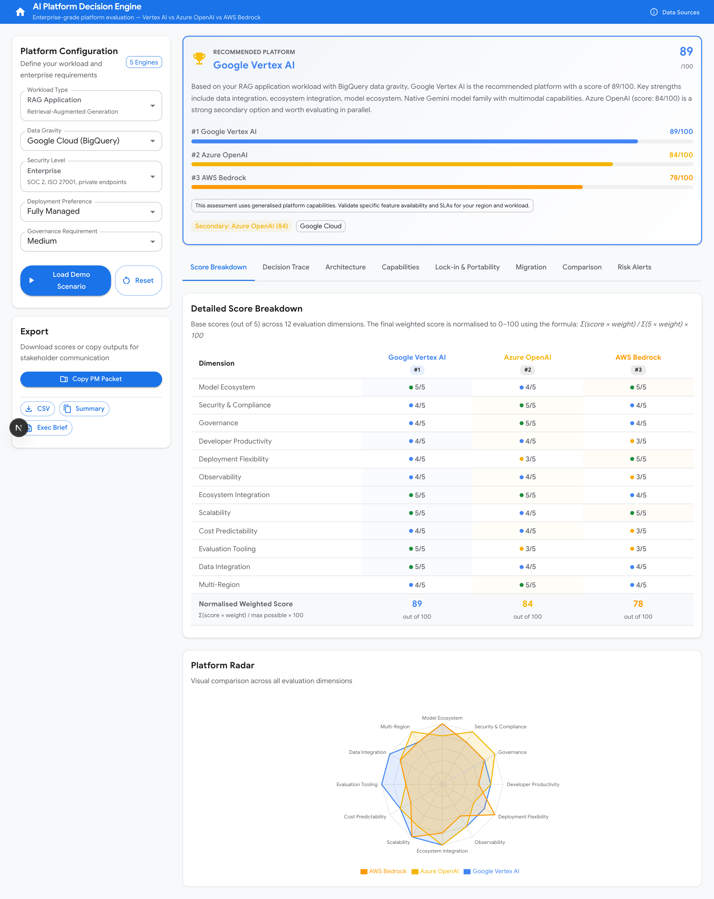

---

### Decision Trace

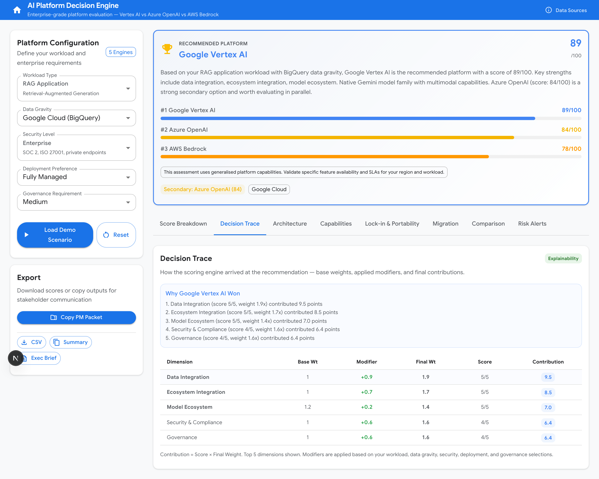

---

### Architecture Generator

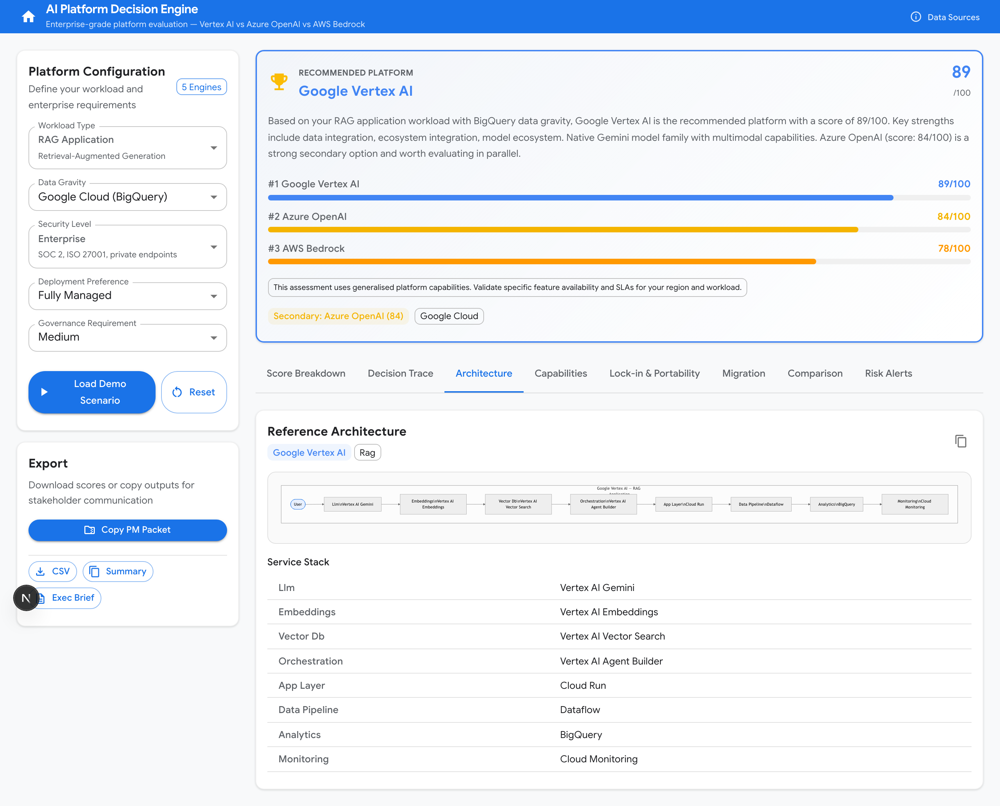

---

### Capability Coverage Matrix

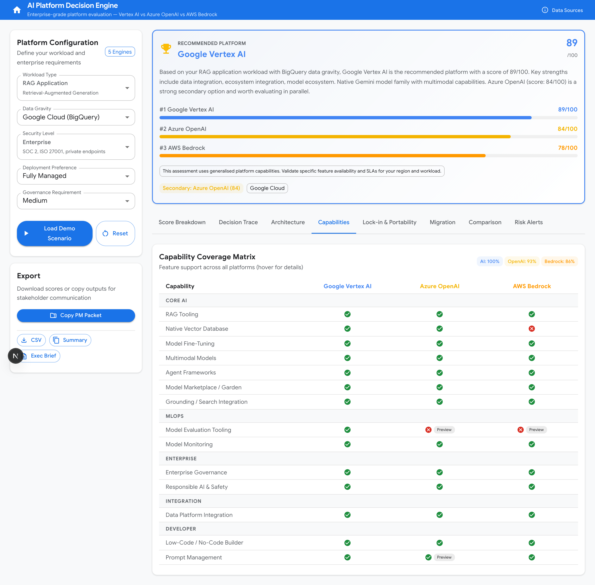

---

### Vendor Lock-in Analysis & Portability Plan

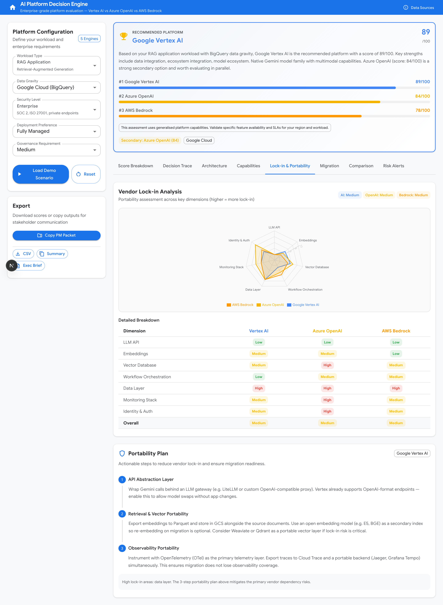

---

### Migration Complexity Estimator

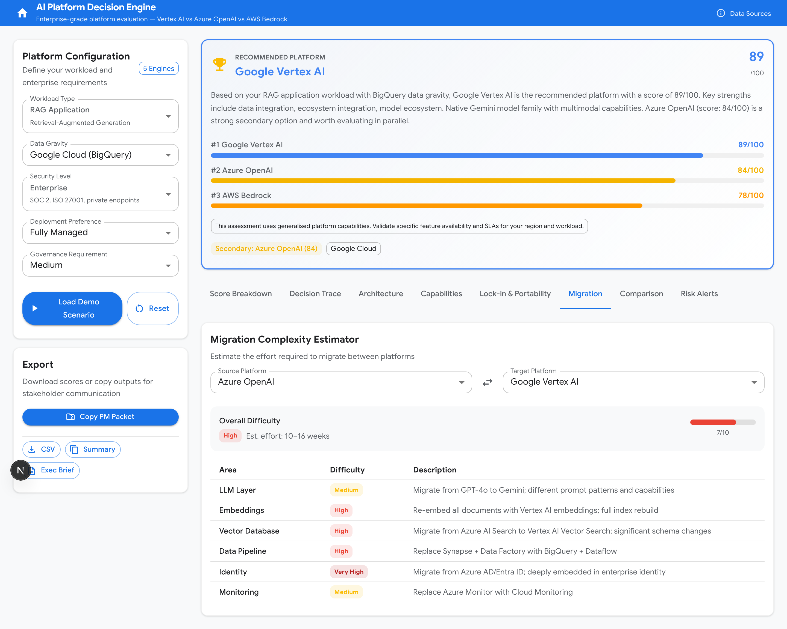

---

### Scenario Comparison

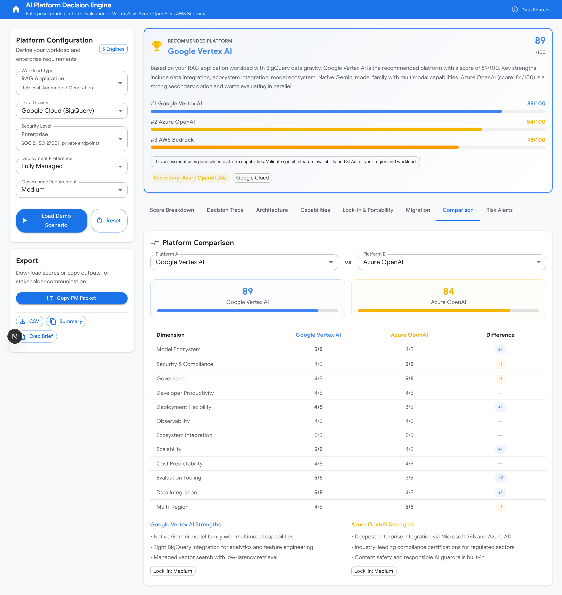

---

### Risk Alerts

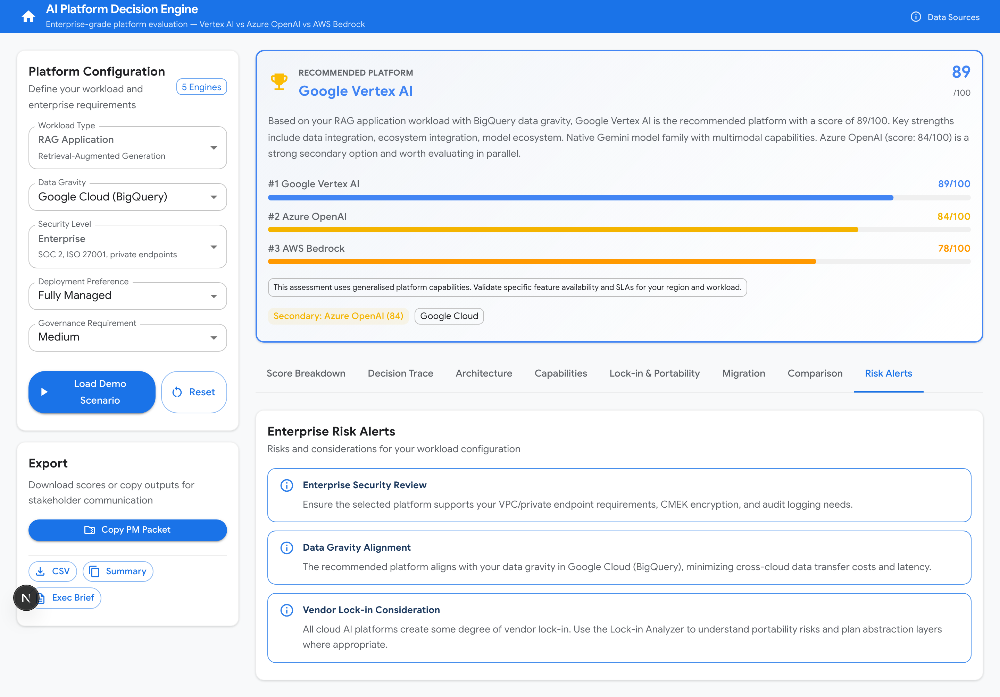

---

### Alternate Scenario — Agent + AWS + Highly Regulated

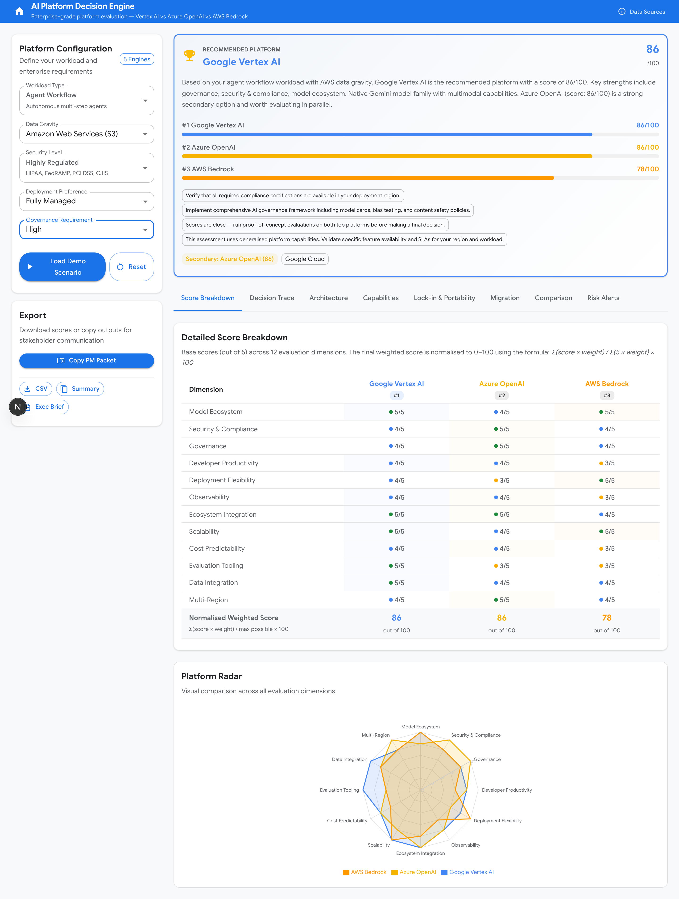

---

### Alternate Scenario — Chatbot + Azure + Standard

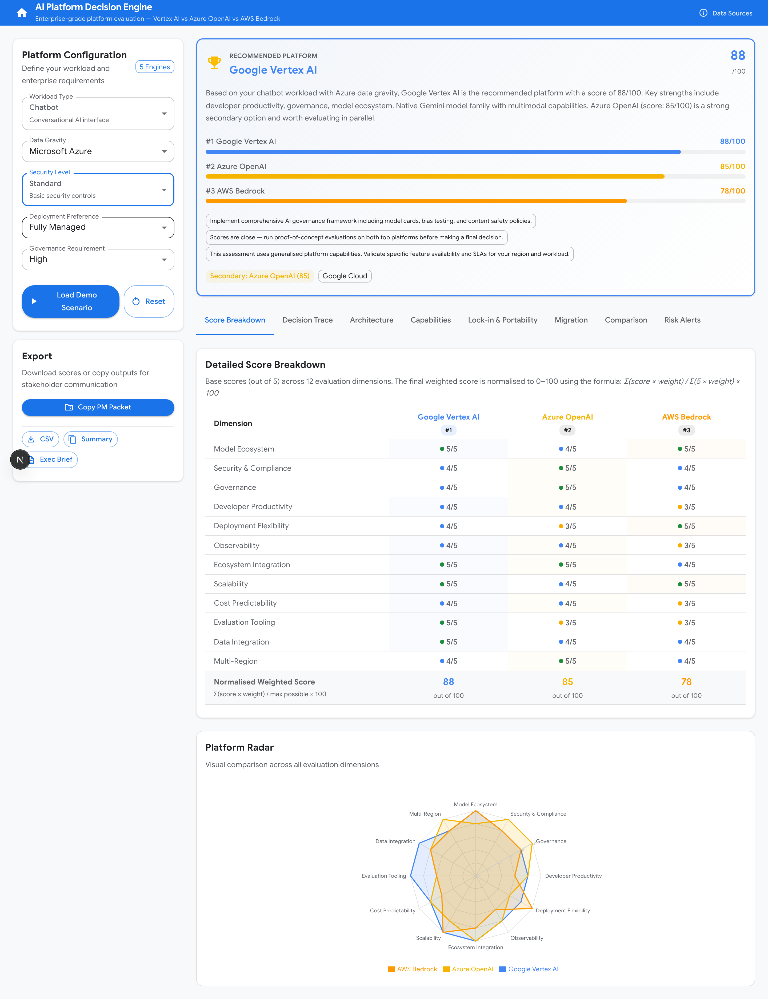

---

### Data Source Disclosure

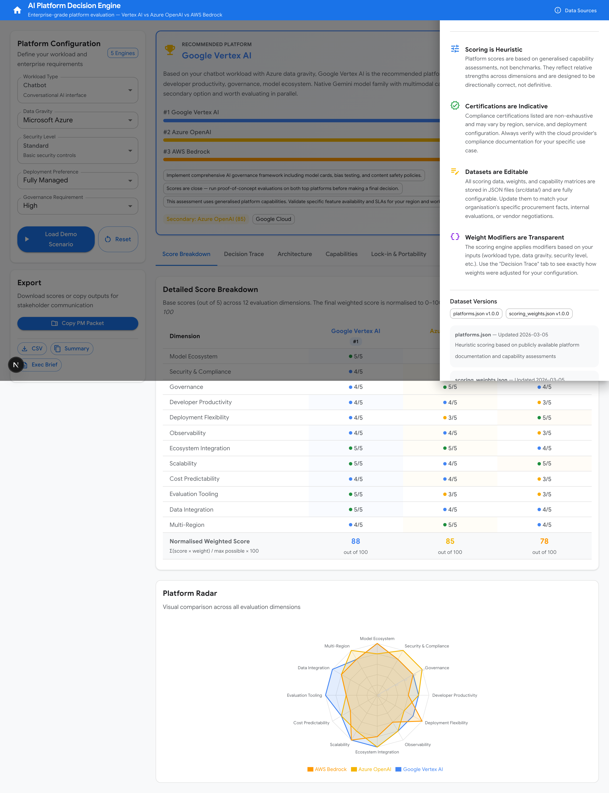

---

## ⚙️ Evaluation Engines

| # | Engine | What it does |
|---|--------|-------------|
| 1 | 🎯 **Platform Scoring** | 18-dimension weighted scoring with modifiers for workload, security, governance, data gravity |
| 2 | 🏗️ **Architecture Generator** | Mermaid reference architectures for 7 workload types across 8 platforms |
| 3 | 🔒 **Vendor Lock-in Analyzer** | 7-dimension portability radar with 3-step migration plans |
| 4 | 🔄 **Migration Estimator** | Difficulty scoring across all cross-platform migration paths |
| 5 | 📊 **Capability Matrix** | 24 capabilities mapped to platform support and maturity |
| 6 | 🧪 **Pilot Plan Generator** | 7-week structured pilot with security checklist and success metrics *(computer-use mode)* |

## 🖥️ Computer-Use Agent Evaluator

Switch to **Computer-Use** mode to evaluate agents across 6 specialized dimensions:

- 📋 **Task Coverage** — scraping, form-fill, data-entry, research, QA testing
- 🔁 **Reliability at N Steps** — success rate over multi-step workflows
- 💰 **Cost per Completed Task** — compute + API + token costs
- 🛡️ **Security Posture** — what the agent can see and access
- 🤝 **Human-in-Loop Gates** — approval checkpoints for sensitive actions
- ✅ **IT Approvability** — enterprise compliance and audit readiness

**Outputs:** vendor scorecard + 7-week pilot plan + rollback strategy

## 🛠️ Tech Stack

- ⚡ **Next.js 16** (App Router) + **React 19**
- 🎨 **Material UI 7** + Emotion
- 📈 **Recharts** (radar charts) + **Mermaid** (architecture diagrams)
- 🔒 **TypeScript** (strict mode)
- 📁 **JSON datasets** — editable, versioned, no database required
- 🐳 **Docker** — multi-stage build, standalone output

## 🚀 Getting Started

```bash
npm install
npm run dev
```

Open [http://localhost:3000](http://localhost:3000) → click **Launch Decision Engine**.

## 📤 Export Capabilities

- 📦 **PM Packet** — combined recommendation, scores, services, risks, lock-in, portability
- 📋 **Vendor Scorecard** — 6-dimension scorecard with verdict *(computer-use mode)*
- 📄 **CSV** — score table download
- 📝 **Executive Brief** — markdown summary for stakeholders

## 📜 License

MIT

---

## Author

**Created & developed by [Phani Marupaka](https://linkedin.com/in/phani-marupaka)**

© 2026 Phani Marupaka. All rights reserved.

Unauthorized reproduction, distribution, or modification of this software, in whole or in part, is strictly prohibited under applicable trademark and copyright laws including but not limited to the Digital Millennium Copyright Act (DMCA), the Lanham Act (15 U.S.C. § 1051 et seq.), and equivalent international intellectual property statutes. This software contains embedded provenance markers and attribution watermarks that are protected under 17 U.S.C. § 1202 (integrity of copyright management information). Removal or alteration of such markers constitutes a violation of federal law.
